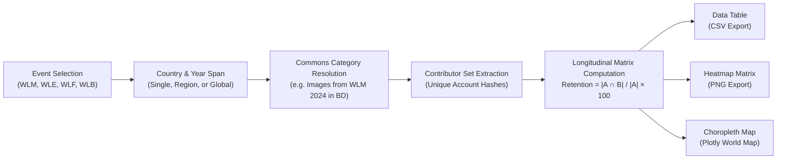

# CampAnalytics — Event Evaluation

> **A high-performance analytics suite for Wikimedia Commons campaigns, longitudinal contributor retention analysis, and regional health benchmarking.**

[](https://toolforge.org)
[](https://www.python.org/downloads/)
[](https://www.gnu.org/licenses/gpl-2.0.html)
[](https://meta.wikimedia.org/wiki/Project_Korikath)

---

## 🌟 Overview

**CampAnalytics** is an open-source analytical platform designed for organizers, program evaluators, and Wikimedia community leaders. It provides data-driven intelligence for major international photography campaigns—including **Wiki Loves Monuments (WLM)**, **Wiki Loves Earth (WLE)**, **Wiki Loves Folklore (WLF)**, and **Wiki Loves Bangla (WLB)**.

By combining real-time metadata from Wikimedia Commons with cohort-based longitudinal analytics, CampAnalytics answers critical programmatic questions:
1. **Contributor Continuity**: How effectively do campaigns retain participant cohorts across consecutive years and across different event types?
2. **Ecosystem Vitality**: How healthy is a specific campaign edition compared to top-performing regional peers operating under similar geographic and resource conditions?

---

## 🚀 Deployment Models

CampAnalytics is architected with a shared core analytics engine powering two production-ready interfaces:

| Interface | Runtime | Primary Target | Highlights |
| :--- | :--- | :--- | :--- |
| **Flask Web App** | WSGI / Gunicorn | **Wikimedia Toolforge** | Fast, lightweight, GLAMtools visual coherence, custom Marine Petrol (`#183f54`) palette, Project Korikath identity, zero client bloat. |
| **Streamlit App** | Streamlit Runtime | **Streamlit Cloud / Local** | Interactive prototyping dashboard, flat dark slate aesthetic (`#0f172a`), reactive data explorer. |

Both interfaces consume identical data models and logic via [`analytics.py`](analytics.py) and [`config.json`](config.json).

---

## 🛠️ Key Capabilities

- **Builder-First Retention Analytics**: Frictionless selection controls for event types, target countries (with a one-click **Select All Global** option), and multi-year spans. Generates pairwise retention data tables, high-contrast Seaborn heatmaps, and interactive Plotly choropleth maps.
- **5-Dimension Weighted Health Scorecard**: Evaluates campaigns on a 0–100 scale:
  - **Retention Index (35%)**: Proportion of returning participants from the designated baseline edition.
  - **Growth Capacity (20%)**: Rate of first-time participant acquisition.
  - **Content Utility (20%)**: Proportion of uploaded media actively illustrated in Wikimedia articles (`prop=globalusage`).
  - **Quality Images (15%)**: Recognition share under official Commons quality banners (`Category:Quality images`, `Category:Featured pictures`).
  - **Contributor Diversity (10%)**: Distribution parity measured via top 10% uploader concentration.
- **Dynamic Regional Peer Normalization**: Replaces static, arbitrary global metrics with dynamic peer envelopes calibrated across 9 geographic clusters (South Asia, ESEAP, Northern & Western Europe, CEE, Latin America & Caribbean, Sub-Saharan Africa, MENA, North America, Southern Europe).
- **Dual-Channel High-Speed Ingestion**: Real-time querying against Wikimedia Toolforge replica databases with automatic fallback to the official Wikimedia Commons Action API (`categorymembers`, `globalusage`, `imageinfo`).
- **In-Memory TTL Caching**: Thread-safe memory cache with 1-hour time-to-live to prevent redundant network strain on Wikimedia infrastructure.

---

## 🏗️ Architecture

```
========================================================================================
                          CAMPANALYTICS — SYSTEM ARCHITECTURE
========================================================================================

     [ Wikimedia Community Analyst / Organiser Browser ]
                            │
               ┌────────────┴────────────┐
               ▼ (Port 5001)             ▼ (Port 8501)
     ┌──────────────────────┐  ┌──────────────────────────────────┐
     │      FLASK APP       │  │          STREAMLIT APP           │
     │    (flask_app.py)    │  │       (streamlit_app.py)         │
     │  • GLAMtools Theme   │  │   • Dark Slate Reactive UI       │
     │  • Toolforge Ready   │  │   • Quick Exploration Explorer   │
     └──────────┬───────────┘  └─────────────────┬────────────────┘
                │                                │
                └───────────────┬────────────────┘
                                ▼
     ┌────────────────────────────────────────────────────────────┐
     │                  SHARED ANALYTICS ENGINE                   │
     │                      (analytics.py)                        │
     ├────────────────────────────────────────────────────────────┤
     │  • Dual Commons Ingestion: Toolforge DB + Action API       │
     │  • Directional Contributor Retention Mathematics           │
     │  • 5-Dimension Health Index & Regional Benchmark Engine    │
     │  • Visualizations (Agg Matplotlib, Seaborn, Plotly)        │
     │  • In-Memory Thread-Safe TTL Caching Layer                 │
     └──────────────────────────┬─────────────────────────────────┘
                                │
               ┌────────────────┴────────────────┐
               ▼                                 ▼
    ┌────────────────────────┐       ┌────────────────────────────┐
    │   Wikimedia Commons    │       │        config.json         │
    │   Action API / DB      │       │   (Event ↔ Country ↔       │
    │   (Live Meta-data)     │       │    Regional Cluster Map)   │
    └────────────────────────┘       └────────────────────────────┘

========================================================================================
```

### Contributor Retention Pipeline



---

## 💻 Installation & Setup

### Prerequisites
- Python 3.9 or higher
- Git

### Clone the Repository
```bash
git clone https://github.com/siddiquetanvir/CampAnalytics.git
cd CampAnalytics
```

### Install Dependencies
```bash
pip install -r requirements.txt
```

---

## 🚦 Running Locally

### Option 1: Run the Flask App (Toolforge Interface)
```bash
python3 app.py
```
*Access in browser at:* `http://localhost:5001`

### Option 2: Run the Streamlit App
```bash
streamlit run streamlit_app.py
```
*Access in browser at:* `http://localhost:8501`

---

## 🧪 Running Automated Tests

CampAnalytics includes a comprehensive unit test suite covering routing, API parameter validation, GLAMtools styling rules, mathematical edge cases, and layout contracts:

```bash
PYTHONPATH=. python3 tests/test_app.py
```

---

## 🌐 Deploying to Wikimedia Toolforge

CampAnalytics is pre-configured for automated Toolforge deployment via buildpacks or classic webservices:

1. **Log in to Toolforge Bastion**:
   ```bash
   ssh <username>@login.toolforge.org
   become <tool-name>
   ```

2. **Clone and Configure**:
   ```bash
   git clone https://github.com/siddiquetanvir/CampAnalytics.git src
   cd src
   ```

3. **Start the Web Service**:
   ```bash
   toolforge webservice buildpack start
   ```
   *The included [`Procfile`](Procfile) and [`app.py`](app.py) expose the WSGI application automatically via Gunicorn.*

---

## 📐 Mathematical Formulation

### 1. Directional Contributor Retention
Retention from a baseline campaign edition $A$ to a subsequent edition $B$ is non-symmetric and defined as:

$$\text{Retention}(A \to B) = \left( \frac{|U_A \cap U_B|}{|U_A|} \right) \times 100\%$$

where $U_A$ and $U_B$ denote the verified sets of unique upload accounts in each respective Commons category.

### 2. Contributor Growth Capacity
New contributor acquisition measures the share of participants in cohort $B$ with no prior record in baseline $A$:

$$\text{Growth}(A \to B) = \left( \frac{|U_B \setminus U_A|}{|U_B|} \right) \times 100\%$$

---

## 📁 Repository Layout

```
CampAnalytics/
├── app.py                   # Production Toolforge WSGI entrypoint
├── flask_app.py             # Flask application & GLAMtools route controllers
├── streamlit_app.py         # Streamlit interactive application
├── analytics.py             # Core analytical computation & Wikimedia API engine
├── app_config.py            # Global application settings, palette, and style loaders
├── config.json              # Event, country, and regional cluster taxonomy
├── styles.css               # Toolforge Flask GLAMtools stylesheet (770+ lines)
├── streamlit_styles.css     # Dedicated Streamlit dark-mode stylesheet
├── Procfile                 # Toolforge / Heroku web process definition
├── requirements.txt         # Python package dependencies
├── templates/               # Jinja2 templates for Flask UI
│   ├── base.html            # Layout shell, top navbar, footer & Korikath brand
│   └── index.html           # Retention Builder, Health Scorecard, Methodology
└── tests/                   # Complete automated test suite
    └── test_app.py          # 27 passing regression and unit test cases
```

---

## 📜 License & Community Attribution

- **License**: Released under the **[GNU General Public License v2.0 or later (GPL-2.0+)](https://www.gnu.org/licenses/gpl-2.0.html)**.
- **Affiliation**: Built in support of **[Project Korikath](https://meta.wikimedia.org/wiki/Project_Korikath)**, an open community knowledge initiative on Meta-Wiki.
- **Data Source**: Live metadata queried directly from **[Wikimedia Commons](https://commons.wikimedia.org)** under open licenses.
