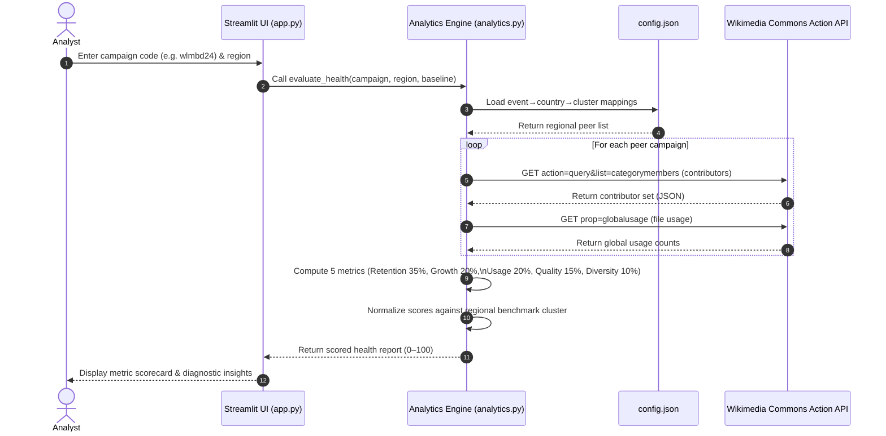
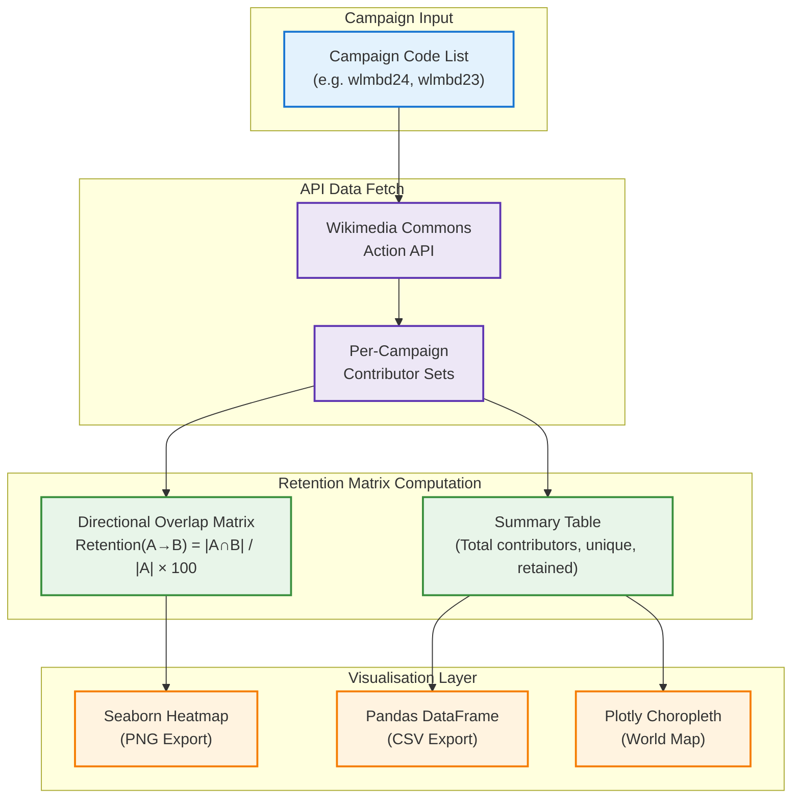

# Wikimedia Campaign Suite

A Streamlit-based analytics platform for evaluating Wikimedia campaign participation, contributor retention, and campaign health across regional peer benchmarks.

## Overview

The Wikimedia Campaign Suite supports organizers, evaluators, and stakeholders working with Wikimedia campaigns such as Wiki Loves Monuments, Wiki Loves Earth, Wiki Loves Folklore, and Wiki Loves Bangla. It combines live Wikimedia metadata with cohort-based analytics to answer two core questions:

- How contributors move across campaigns and years.
- How healthy a campaign appears relative to regional peer performance.

The application has two main operating modes:

1. **Retention Analytics**
   - Compare contributor overlap across years and campaigns.
   - View retention matrices, summary tables, and world maps.
2. **Health Evaluation**
   - Score a campaign using weighted metrics against regional benchmark clusters.
   - Surface diagnostics and actionable insights for program strategy.

## Key Features

- **Reliable Data Acquisition:** Direct extraction of campaign contributors and file metadata from the official Wikimedia Commons Action API with automatic retries and connection pooling.
- **Regional Peer Benchmarking:** Dynamic benchmark calibration by geographic cluster (South Asia, ESEAP, Europe, LAC, SSA, NA, etc.).
- **5-Dimension Weighted Health Scoring:** Evaluates Retention (35%), Growth Capacity (20%), Content Utility / Usage (20%), Quality Image Share (15%), and Contributor Diversity (10%).
- **Interactive Visualizations:** Retention heatmaps, summary data tables, and choropleth world map views.
- **Exportable Outputs:** Downloadable high-resolution heatmap images (PNG) and data matrices (CSV).
- **Professional Flat Dark UI:** Streamlit interface styled with flat design principles and Project Korikath / Wikimedia theme colors.

## 🏗️ Architecture

### 1. System Overview (ASCII)

```
========================================================================================
              WIKIMEDIA CAMPAIGN SUITE — SYSTEM ARCHITECTURE
========================================================================================

   [ KUET Student / Analyst Browser ]
                  │
                  ▼  HTTPS
   ┌──────────────────────────────────────────────────────────────────────┐
   │                        STREAMLIT APPLICATION                         │
   │                            (app.py)                                  │
   ├──────────────────────┬───────────────────────────────────────────────┤
   │   Retention Mode     │            Health Evaluation Mode             │
   │  • Campaign Matrix   │  • 5-Dimension Weighted Scoring (0–100)       │
   │  • Heatmaps / Maps   │  • Regional Peer Benchmark Calibration        │
   └──────────┬───────────┴─────────────────────┬─────────────────────────┘
              │                                 │
              ▼                                 ▼
   ┌──────────────────────────────────────────────────────────────────────┐
   │                       ANALYTICS ENGINE                               │
   │                         (analytics.py)                               │
   ├──────────────────────────────────────────────────────────────────────┤
   │  • Commons Action API client (HTTP, retries, connection pooling)     │
   │  • Contributor set computation & directional retention math          │
   │  • Health metric calculation (Retention, Growth, Usage, Quality,     │
   │    Diversity) & dynamic regional benchmark scoring                   │
   │  • Visualization generators (Seaborn heatmap, Plotly choropleth)     │
   └──────────────────────────────────┬───────────────────────────────────┘
                                      │
              ┌───────────────────────┴──────────────────────┐
              ▼                                              ▼
   ┌─────────────────────────┐                  ┌───────────────────────────┐
   │  Wikimedia Commons      │                  │   config.json             │
   │  Action API             │                  │  (Event ↔ Country ↔       │
   │  (External, live)       │                  │   Regional Cluster Map)   │
   └─────────────────────────┘                  └───────────────────────────┘

========================================================================================
```

---

### 2. Health Evaluation & API Data Flow (Mermaid)



---

### 3. Retention Analytics Pipeline (Mermaid)



---

### 4. Tech Stack

| Layer | Technology | Purpose |
| :--- | :--- | :--- |
| **UI Framework** | Streamlit | Interactive Python web app, routing, and component rendering |
| **Data Engine** | Pandas, NumPy | Contributor set math, retention matrix computation, metric aggregation |
| **API Client** | `requests` (connection pooling, retries) | Live extraction from Wikimedia Commons Action API |
| **Visualization** | Seaborn, Plotly, Matplotlib | Heatmaps, choropleth world maps, data tables |
| **Configuration** | `config.json` | Externalised event → country → regional cluster mapping |
| **Styling** | CSS (`styles.css`) | Flat dark Wikimedia-themed UI |
| **Runtime** | Python 3.9+ | Core execution environment |

---

## File Structure

- `app.py` — Streamlit application, UI components, and routing.
- `analytics.py` — Data collection, Commons API integration, metric calculation, scoring engine, and visualization generation.
- `config.json` — Externalized configuration mapping events, countries, and regional clusters.
- `styles.css` — Professional flat dark theme stylesheet.
- `requirements.txt` — Project Python package dependencies.
- `SCIENTIFIC_REVIEW.md` — Original methodological review and caveats.

## Methodology

### Retention Analytics

Directional campaign retention is calculated as:

$$\text{Retention}(\text{Source} \to \text{Target}) = \left(\frac{|\text{Source} \cap \text{Target}|}{|\text{Source}|}\right) \times 100$$

This supports cross-year and cross-event movement analysis for contributors.

### Health Evaluation

The health score is computed on a 0–100 scale using a weighted composite framework across five structural indicators:

- **Retention (35%):** Percentage of users retained from the baseline campaign.
- **Growth Capacity (20%):** Percentage of fresh, first-time active contributors.
- **Usage / Content Utility (20%):** Percentage of uploaded campaign files actively used across Wikimedia wikis (`prop=globalusage`).
- **Quality Image (15%):** Percentage of uploads recognized under official Commons quality categories (`Category:Quality images`, `Category:Featured pictures`).
- **Diversity (10%):** Top 10% uploader share (measures upload concentration; lower concentration indicates broader participation).

### Regional Benchmarking

The campaign is compared against the strongest peer countries in the same geographic group. The app:

1. Selects the region for the target campaign.
2. Identifies peer countries in that region.
3. Computes dynamic benchmark values from the top regional performer cluster.
4. Normalizes the target campaign against those values.

This reduces unfair comparisons caused by static global thresholds and better reflects regional campaign conditions.

## Installation

### Prerequisites

- Python 3.9+
- Internet access for Wikimedia API requests

### Install Dependencies

```bash
pip install -r requirements.txt
```

*(Alternatively: `pip install streamlit requests numpy pandas matplotlib seaborn plotly packaging`)*

### Run the App

```bash
streamlit run app.py
```

## Usage

### Campaign Syntax

Use campaign identifiers in this form:

`[event][country][year]`

Examples:

- `wlmbd24` — Wiki Loves Monuments Bangladesh 2024
- `wlmde25` — Wiki Loves Monuments Germany 2025
- `wlein22` — Wiki Loves Earth India 2022

### Retention Analytics Workflow

1. Choose **Retention Analytics** in the App Mode.
2. Enter campaign codes or use the **Selection Builder** helper.
3. Click **Run Retention Analysis** to compute retention matrices and summary tables.
4. Switch visualization models (Data Table, Heatmap Matrix, Choropleth) and download outputs.

### Health Evaluation Workflow

1. Choose **Health Evaluation** in the App Mode.
2. Enter the target campaign code (e.g. `wlmbd24`).
3. Select the **Benchmark Baseline** (Previous Year Baseline or Custom Baseline Code).
4. Choose the geographic region.
5. Click **Evaluate Campaign Health**.
6. Review the 5-metric scorecard and automated diagnostic insights.

## License

This project is intended for research and operational analysis use in Wikimedia campaign monitoring. Please review repository policy and licensing terms before redistribution or deployment in production environments.
